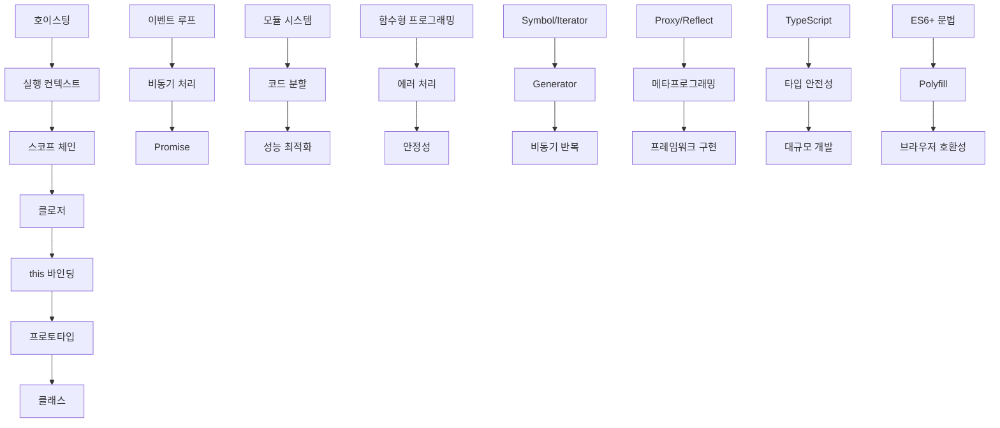

# JavaScript Core 전공 지식 모음

이 폴더는 JavaScript의 핵심 개념과 고급 기법에 대한 전문적인 내용을 담고 있습니다.

## 📚 목차

### 기본 개념과 실행 환경

- [실행 컨텍스트와 스코프 체인](execution-context-scope-chain.md)
- [호이스팅(hoisting)과 TDZ(Temporal Dead Zone)](hoisting-tdz.md)
- [클로저(closure)의 구조와 용도](closure-structure-usage.md)
- [이벤트 루프, 콜 스택, 마이크로태스크 vs 매크로태스크](event-loop-call-stack-tasks.md)
- [브라우저 환경과 Node.js의 차이점](browser-nodejs-differences.md)

### 객체지향과 함수형 프로그래밍

- [this 바인딩 규칙 (암시적, 명시적, new, 화살표 함수)](this-binding-rules.md)
- [프로토타입 기반 상속과 **proto**, prototype 체계](prototype-inheritance.md)
- [클래스(Class)와 클래스 내부의 동작 원리 (syntactic sugar)](class-syntactic-sugar.md)
- [함수형 프로그래밍 기본 (고차함수, 순수 함수, map/filter/reduce)](functional-programming-basics.md)

### 모듈과 비동기 프로그래밍

- [모듈 시스템 (ESM vs CommonJS, 동적 import)](module-systems.md)
- [비동기 처리 모델 (콜백, Promise, async/await, 병렬/직렬 처리)](async-processing-models.md)

### 고급 기능과 메타프로그래밍

- [구조 분해 할당, 전개 연산자, rest 파라미터](destructuring-spread-rest.md)
- [Symbol, Iterator, Generator의 원리 및 활용](symbol-iterator-generator.md)
- [Proxy와 Reflect를 이용한 메타프로그래밍](proxy-reflect-metaprogramming.md)

### 타입 안전성과 개발 환경

- [타입 안전성과 TypeScript의 통합 전략](type-safety-typescript-integration.md)
- [ES6+ 문법 변화 및 Polyfill 이해](es6-plus-polyfills.md)

### 에러 처리와 안정성

- [에러 처리 패턴 (try-catch, error bubbling, 커스텀 에러 클래스)](error-handling-patterns.md)

### 기존 파일들

- [JavaScript 이벤트 루프](javaScript-EventLoop.md)
- [JavaScript Promise](javaScript-Promise.md)
- [JavaScript 배열 최적화](JavaScript-Array%20최적화.md)
- [JavaScript 기본개념](JavaScript-기본개념.md)
- [JavaScript 싱글스레드와 멀티스레드](JavaScript-싱글스레드와-멀티스레드.md)
- [JavaScript 메모리관리](JavaScript-메모리관리.md)

## 🎯 학습 가이드

### 초급 개발자를 위한 학습 순서

1. **JavaScript 기본개념** → **실행 컨텍스트와 스코프 체인** → **호이스팅과 TDZ**
2. **클로저** → **this 바인딩** → **구조 분해 할당과 전개 연산자**
3. **JavaScript 이벤트 루프** → **이벤트 루프, 콜 스택, 마이크로태스크** → **비동기 처리 모델** → **Promise**

### 중급 개발자를 위한 학습 순서

1. **프로토타입 기반 상속** → **클래스와 내부 동작 원리**
2. **함수형 프로그래밍 기본** → **고급 배열 메서드와 최적화**
3. **모듈 시스템** → **ES6+ 문법 변화와 Polyfill**
4. **에러 처리 패턴** → **메모리 관리** → **성능 최적화**

### 고급 개발자를 위한 학습 순서

1. **Symbol, Iterator, Generator** → **Proxy와 Reflect 메타프로그래밍**
2. **브라우저 vs Node.js 환경 차이** → **싱글스레드와 멀티스레드**
3. **타입 안전성과 TypeScript 통합** → **대규모 애플리케이션 아키텍처**
4. **고급 비동기 패턴** → **성능 모니터링과 최적화**

## 🔄 연관 관계

## 💡 핵심 개념 요약

### 실행과 스코프

- **실행 컨텍스트**: JavaScript 코드 실행 환경
- **스코프 체인**: 변수 해결을 위한 참조 체인
- **호이스팅**: 선언의 끌어올림 현상
- **TDZ**: let/const의 접근 불가 구간

### 함수와 객체

- **클로저**: 렉시컬 환경 보존 메커니즘
- **this**: 동적 컨텍스트 바인딩
- **프로토타입**: JavaScript의 상속 체계
- **클래스**: 프로토타입의 syntactic sugar

### 비동기와 모듈

- **이벤트 루프**: 비동기 처리의 핵심
- **마이크로태스크/매크로태스크**: 실행 우선순위 체계
- **Promise**: 비동기 값 처리 객체
- **async/await**: Promise의 동기적 표현
- **모듈**: 코드 분리와 재사용 체계

### 함수형과 에러 처리

- **순수 함수**: 부작용 없는 함수
- **고차 함수**: 함수를 다루는 함수
- **map/filter/reduce**: 함수형 배열 처리
- **구조 분해 할당**: 값 추출의 간편한 문법
- **전개 연산자**: 배열/객체 복사와 병합
- **에러 버블링**: 에러 전파 메커니즘
- **커스텀 에러**: 도메인별 에러 분류

### 고급 기능

- **Symbol**: 유일한 식별자 생성
- **Iterator**: 순회 가능한 객체 프로토콜
- **Generator**: 실행 제어 가능한 함수
- **Proxy**: 객체 동작 가로채기
- **Reflect**: 메타프로그래밍 API
- **메타프로그래밍**: 코드가 코드를 조작하는 기법

### 개발 환경과 도구

- **TypeScript**: 정적 타입 검사 시스템
- **타입 안전성**: 런타임 에러 방지
- **ES6+ 문법**: 현대적 JavaScript 기능
- **Polyfill**: 구형 브라우저 호환성 확보
- **Transpilation**: 코드 변환 과정
- **브라우저 vs Node.js**: 실행 환경별 차이점

## 🚀 실무 활용 팁

### 성능 최적화

1. **메모리 누수 방지**: 클로저와 이벤트 리스너 정리
2. **비동기 최적화**: 병렬 처리와 배치 처리 활용
3. **모듈 분할**: 동적 import로 코드 스플리팅
4. **함수형 패턴**: 지연 평가와 메모이제이션
5. **환경별 최적화**: 브라우저와 Node.js 특성 활용

### 코드 품질

1. **명확한 스코프**: let/const 사용으로 TDZ 활용
2. **일관된 this**: 화살표 함수와 bind 적절한 사용
3. **모듈화**: ESM을 통한 깔끔한 의존성 관리
4. **타입 안전성**: TypeScript를 통한 정적 타입 검사
5. **에러 처리**: 계층적 에러 핸들링과 복구 전략

### 고급 패턴

1. **메타프로그래밍**: Proxy와 Reflect를 활용한 동적 동작
2. **제너레이터 활용**: 비동기 반복과 상태 관리
3. **Symbol 활용**: 충돌 없는 프로퍼티 키 생성
4. **구조 분해**: 복잡한 데이터 추출의 간소화
5. **함수형 조합**: 고차 함수를 통한 로직 재사용

### 디버깅과 모니터링

1. **실행 컨텍스트 이해**: 스코프 체인 추적
2. **이벤트 루프 모니터링**: 성능 병목 지점 파악
3. **비동기 에러 처리**: Promise chain과 async/await 에러 핸들링
4. **메모리 프로파일링**: 클로저와 순환 참조 확인
5. **환경별 디버깅**: 브라우저와 Node.js 도구 활용

### 현대적 개발 워크플로우

1. **Polyfill 전략**: 필요한 기능만 선택적 로드
2. **빌드 최적화**: Babel과 Webpack을 통한 변환
3. **타입 시스템**: 점진적 TypeScript 도입
4. **모듈 전략**: ESM과 CommonJS 혼용 전략
5. **성능 측정**: 브라우저와 Node.js 성능 도구 활용

## 📖 추천 학습 리소스

### 공식 문서

- [MDN JavaScript Guide](https://developer.mozilla.org/en-US/docs/Web/JavaScript/Guide)
- [ECMAScript Specification](https://tc39.es/ecma262/)
- [TypeScript Handbook](https://www.typescriptlang.org/docs/)
- [Node.js Documentation](https://nodejs.org/en/docs/)

### 도서

- "You Don't Know JS" 시리즈 - Kyle Simpson
- "JavaScript: The Definitive Guide" - David Flanagan
- "Eloquent JavaScript" - Marijn Haverbeke
- "Functional-Light JavaScript" - Kyle Simpson
- "Effective TypeScript" - Dan Vanderkam

### 온라인 리소스

- [JavaScript.info](https://javascript.info/) - 현대적 JavaScript 튜토리얼
- [V8 Blog](https://v8.dev/blog) - JavaScript 엔진 내부 동작
- [TC39 Proposals](https://github.com/tc39/proposals) - 최신 JavaScript 제안
- [Can I Use](https://caniuse.com/) - 브라우저 호환성 확인
- [Babel REPL](https://babeljs.io/repl) - 코드 변환 실습

### 도구와 환경

- **개발 도구**: VS Code, Chrome DevTools, Node.js Inspector
- **빌드 도구**: Babel, Webpack, Vite, Rollup
- **타입 체킹**: TypeScript, Flow, JSDoc
- **테스팅**: Jest, Mocha, Cypress, Playwright
- **린팅**: ESLint, Prettier, JSHint

---

_"JavaScript를 진정으로 이해하려면 그 내부 동작 원리를 파악해야 합니다. 이 문서들은 그 여정의 나침반이 될 것입니다. 현대적인 JavaScript 개발은 단순히 문법을 아는 것을 넘어, 언어의 철학과 생태계를 이해하는 것에서 시작됩니다."_
